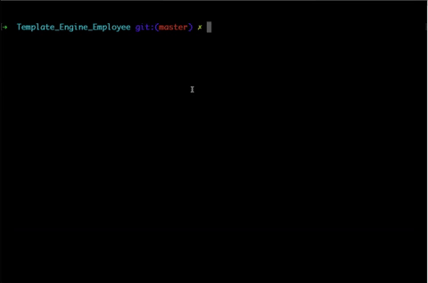

# Template Engine - Employee Summary

The application will demonstrate a Node CLI that takes in information about employees and generates an HTML webpage that displays summaries for each person. All unit test will be shown to pass.

## Instructions

Using Node CLI, the application will prompt the user for information about the team manager and then information about the team members. 

When the user has completed building the team, the application will create an HTML file that displays a nicely formatted team roster based on the information provided by the user. 

  Run 

## Technology

Utilized:
- node.js
- npm packages (jest, inquirer)

## Screenshot
node app.js demonstration:

HTML Screenshot:

## Links to Video Demonstration

Images Folder:
- images/npmruntest.mp4
- images/node_demo.mp4

